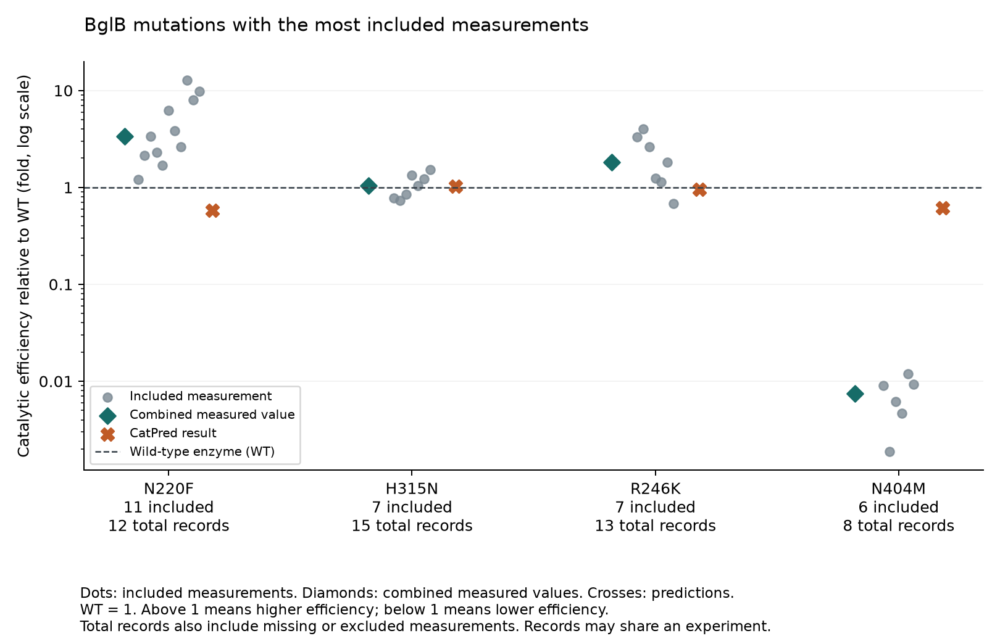

# BglB mutation analysis

[](https://github.com/MixinZh/bglb-mutation-analysis/actions/workflows/tests.yml)

The Design to Data (D2D) program has captured 1,519 student-generated characterization data points for beta-glucosidase B (BglB) into a curated dataset. The dataset contains activity-improving variants, making it useful for identifying chemical features for performance-enhanced design.

Those 1,519 records include 1,192 mutant records and 327 wild-type (WT) records. Students submit their experimental results to the shared [D2D database](https://d2d.ucdavis.edu/d2d-database-app), where they are reviewed before being posted.

This project compares those experimental measurements with predictions from [CatPred](https://github.com/maranasgroup/CatPred): **does CatPred predict which BglB mutations increase or decrease catalytic efficiency compared with WT?** Catalytic efficiency is measured as `kcat/KM`. The experiments compared here use the substrate pNPG.

The measurements come from the public [D2D BglB database](https://d2d-cure.vercel.app/database/characterization_data/BglB), with credit to D2D and the people who generated them. This analysis uses an older saved copy of the database.

## What did the comparison find?

**The CatPred predictions agree with some measured changes but miss others.**
For example, for N220F, the 11 included measurements are above WT, but CatPred predicts a value below WT. For H315N, the combined measurements and the prediction show similar results, close to WT.

The table and figure below show the four selected mutations with at least six experimental measurements included. These mutations are selected using [selection_policy.json](selection_policy.json). Agreement with CatPred does not determine which mutations are selected or shown.

In the chart below, **WT is set to 1.** A ratio above 1 means higher catalytic efficiency than WT. A ratio below 1 means lower efficiency.

| Mutation | D2D records in snapshot | Usable measurements | Included measurements | Combined measured efficiency / WT | CatPred efficiency / WT |
|---|---:|---:|---:|---:|---:|
| N220F | 12 | 11 | 11 | 3.36 | 0.58 |
| H315N | 15 | 8 | 7 | 1.04 | 1.03 |
| R246K | 13 | 7 | 7 | 1.82 | 0.95 |
| N404M | 8 | 7 | 6 | 0.0075 | 0.62 |

The first count includes every database record for that mutation in the snapshot, including kinetic measurements that are excluded under [selection_policy.json](selection_policy.json).
The second counts usable measurements from the earlier data review. The third count shows the records that were retained after the additional selection described below.



The figure files are unchanged and still use some older wording.

For **N220F**, the included measurements range from 1.21 to 12.68 times WT. They disagree about the size of the increase, but all are above WT. Their combined value is 3.36 times WT, compared with CatPred's 0.58 times WT.
For **R246K**, the combined measured value is 1.82 times WT, but individual measurements range from 0.68 to 4.00 times WT. Unlike N220F, its measurements do not all point in the same direction.
For **N404M**, all six included measurements are below 0.012 times WT. CatPred also predicts a decrease, but its prediction of 0.62 times WT is much higher than the measured values.

## How is the combined measured value calculated?

The source file exported from the D2D database contains `Institution` and `Created by` columns that allow you to identify where the data came from and who submitted them. This analysis groups records using **`Created by`, the submitter username**. Each comparison includes one specific amino acid substitution. Measurements of other substitutions at position N220, for example, N220A, are not counted as measurements of N220F.

For each selected mutation:

1. **Compare each included measurement with its WT reference.** Divide the mutant's `kcat/KM` by the reference WT's `kcat/KM`, required when you submit mutant data, then take `log10` of that ratio. The WT reference must be recorded with the mutant record or calculated from WT measurements submitted under the same username.
```
measurement effect = log10(mutant efficiency / reference WT efficiency)
```
On the log10 scale, WT is 0, ten times WT is +1, and one tenth of WT is -1. The medians are then calculated based on that scale. The result is **not an arithmetic average of all measurements, or a single median taken across all measurements**.

For CatPred, the predicted WT efficiency is used as the reference.
The code also checks whether CatPred correctly ranks mutations by efficiency, how far its predictions are from the measurements, and whether it predicts an increase or decrease relative to WT. For the increase-or-decrease check, it uses mutant prediction / reference WT and it only marks values below 0.63 or above 1.58 times WT as significant.

## How were measurements chosen?

The rules in [selection_policy.json](selection_policy.json) are applied to every mutation. CatPred predictions are not used to decide which measurements or mutations pass.
Start with [data/bglb/measurements.csv](data/bglb/measurements.csv), which contains measurements that passed the earlier checks. These are then filtered further to keep only measurements with a known submitter username, an allowed WT reference, and no earlier data-quality flag marking them as less reliable.

- An allowed WT reference is either recorded with that mutant record or calculated from WT measurements under the same username. Measurements using only the database-wide WT reference are excluded. Measurements with an unknown username or an earlier flag are also excluded from the selected comparison.
An excluded record does not automatically exclude the whole mutation. Its other measurements can still qualify. Usable measurements left out at this step remain part of the original broader comparison.

A mutation must have **at least four included measurements from at least four distinct submitter usernames**.
For each mutation, check two lists: the individual measurement effects and the medians for each username. Both lists use the log10 scale. Exclude the mutation if either list:

- Contains both a value at or below -0.2 and a value at or above +0.2.
- Has a sample standard deviation greater than 0.60.

The -0.2 and +0.2 cutoffs correspond to about 0.63 and 1.58 times WT. These rules limit opposing changes and large variation. They do not require every measurement to fall on the same side of WT, and passing them does not prove that the measurements are correct.
Mutations that pass the checks above are then ranked by the number of included measurements, with larger counts first. Break ties using the total number of database records, then position and mutation name.

The main figure shows those with at least six included measurements. All mutations that pass with at least four included measurements remain in the analysis and the full figure.
**Eleven mutations meet the rules, with 63 included measurements in total.** Along with N220F, H315N, R246K, and N404M, they are N270W, W325Q, C38S, E406Q, H223A, W325M, and E340A.
[View all 11 selected mutations](docs/figures/all_selected.png).

The code also reports all **33 mutations with at least four usable measurements**, before the additional selection above. That comparison keeps its original combined measured values and gives more mixed results. The 11-mutation comparison uses values recalculated from the measurements retained by the revised rules.
The narrower selection does not silently replace the broader result. The outputs record why each mutation and each mutant record was included or excluded. See the [selection methods](docs/methods.md#revised-selection) for the full rules.

## Reproduce the results

Python 3.10 or later is required. From a fresh clone:

```bash
git clone https://github.com/MixinZh/bglb-mutation-analysis.git
cd bglb-mutation-analysis
python -m venv .venv
source .venv/bin/activate
python -m pip install '.[plots]'
bglb-reproduce --out results --plot
python -m unittest discover -s tests -v
```

On Windows, activate the environment with `.venv\Scripts\activate`.

The numerical inputs are included in [data/bglb](data/bglb). No lab folder, account, GPU, or model download is needed. The calculations use the Python standard library. Matplotlib is needed only for figures. For tables without figures, install `.` instead of `'.[plots]'` and omit `--plot`.

The command checks input file hashes, record counts, and expected mutation sequences against WT. It recalculates catalytic efficiencies and WT comparisons, checks that the original combined measured values can be reproduced, and verifies the normalization of the CatPred predictions. It then rebuilds the selection, tables, figures, and metrics.

Tests compare the outputs with the earlier verified analysis. They also check that changed measurements, incorrect WT references, missing predictions, and unexplained exclusions stop the calculation. The code does not train models or recreate every original raw-data check.

Existing nonempty output folders are preserved. Use a different `--out` folder for another run.

### Output files

| File | Contents |
|---|---|
| `selection.csv` | Selection decisions for every mutation. |
| `record_selection.csv` | Inclusion or exclusion reasons for all 1,192 mutant records. |
| `comparison.csv` | All 33 repeatedly measured mutations, with original and revised measured summaries. |
| `summary.json` | Rules, metrics, validation counts, and input and code hashes. |
| `report.md` | A readable summary of the results. |
| `comparison.png` | The four selected mutations with at least six included measurements, when plotting is enabled. |
| `all_selected.png` | All 11 selected mutations, when plotting is enabled. |

## Use the comparison code with other inputs

An invented example shows the required table format:

```bash
bglb-compare --consensus examples/synthetic/consensus.csv --measurements examples/synthetic/measurements.csv --predictions examples/synthetic/predictions.csv --policy selection_policy.json --model demo_model --dataset-label SYNTHETIC-DEMO --out demo_results
```

**This synthetic example provides no evidence about CatPred.** The command can also compare other previously checked tables in the same format. It checks record counts, grouping, and combined measured values before comparing them with predictions. The [input guide](docs/methods.md#required-inputs) describes the required fields.

## What data are included?

The input snapshot contains **1,519 D2D records: 1,192 mutant records and 327 WT records**. The mutant records cover **756 distinct single amino acid substitutions**. The 1,519 total is not a count of different mutants or independent experiments.
The repository includes numerical measurements and earlier data-check results for those records, **968 usable mutant measurements**, a summary table covering the 756 substitutions, and CatPred results for the **615 mutations** with usable measured values for comparison.
Submitter usernames have been replaced with consistent IDs without changing which records are grouped together. Names, institutions, lab notebooks, and instrument files are not included. Each record retains its D2D ID so readers can check it against the public database. The [data guide](data/bglb/README.md) explains the files and their dates.

## Credit, citation, and contributions

Mixin Zhao is the sole author and code contributor for this repository. AI tools were used during code development and review.
Credit for the experimental measurements belongs to [D2D](https://d2d.ucdavis.edu/d2d-database-app) and the people who generated them. Credit for [CatPred](https://github.com/maranasgroup/CatPred) belongs to its developers. This is not an official D2D or CatPred repository. These are external data and model sources, not code contributors to this repository.
Use [CITATION.cff](CITATION.cff) to cite this analysis, and credit D2D and CatPred when using their data or predictions.
Corrections and improvements are welcome through GitHub issues or pull requests. Include a small example, the expected behavior, and the test result.

## License

The code and documentation are copyright 2026 Mixin Zhao and are released under the [MIT License](LICENSE). That license does not relicense D2D data or CatPred, which remain subject to their own terms.
